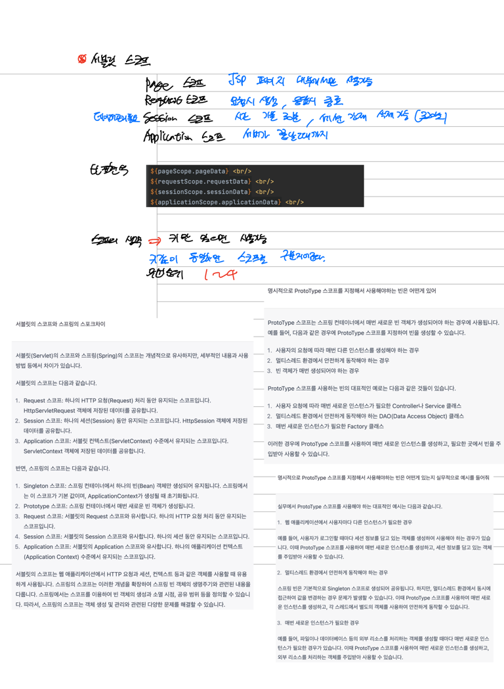

# 서블릿 고급
- 톰캣의 JSP -> Servlet 변환
  - HTML과 Java 코드를 함께 작성해야 하기 때문에 복잡하고 가독성이 떨어지는 Servlet
  ```java
      @Override
    protected void service(HttpServletRequest req, HttpServletResponse resp) throws ServletException, IOException {
        resp.setContentType("text/html; charset=utf-8");
        PrintWriter out = resp.getWriter();
        String html1 = "<html>\n" +
                "<head>\n" +
                "    <title>Index</title>\n" +
                "</head>\n" +
                "<body>\n" +
                "<h1>Index Page</h1>\n" +
                "<hr/>\n";
        out.println(html1);

        // 자바 영역 파싱
        Random r = new Random();
        int num = r.nextInt(5) + 1;

        String html2 = "<h2>당신의 번호는 : ";
        out.println(html2);

        // 자바 영역 파싱
        out.println(num);

        String html3 = "</h2>\n" +
                "</body>\n" +
                "</html>";
        out.println(html3);
    }
  ```
  - JSP은 HTML 내부에 Java 코드를 삽입하여 작성할 수 있기 때문에 가독성이 뛰어나고 쉽게 개발할 수 있다.
  ```html
  <%@ page contentType="text/html;charset=UTF-8" language="java" %>
  <%
      pageContext.setAttribute("pageData", "1111"); //page scope
      request.setAttribute("requestData", "2222"); // request scope
      session.setAttribute("sessionData", "3333"); // session scope
      application.setAttribute("applicationData", "4444"); // application scope
  %>
  <!doctype html>
  <html lang="en">
  <head>
      <meta charset="UTF-8">
      <meta name="viewport"
            content="width=device-width, user-scalable=no, initial-scale=1.0, maximum-scale=1.0, minimum-scale=1.0">
      <meta http-equiv="X-UA-Compatible" content="ie=edge">
      <title>Document</title>
  </head>
  <body>
  <h1>Servlet Scope</h1>
  <hr/>
  ${pageScope.pageData} <br/>
  ${requestScope.requestData} <br/>
  ${sessionScope.sessionData} <br/>
  ${applicationScope.applicationData} <br/>
  </body>
  </html>
  ```
  - JSTL, EL과 같은 태그 라이브러리를 이용해 Java 코드를 삽입한다.
  - JSTL : JSP 페이지에서 자주 사용되는 기능을 담은 태그 라이브러리로 제어 구조, 반복문 처리 담당
  - EL :  자바 코드를 작성하지 않고도 JSP 페이지에서 변수를 참조
  - 이렇게 작성한 JSP를 톰캣이 Servlet으로 변환한다.
  - 실제로, 변환한 서블릿을 톰캣에서 확인할 수 있다.
- JSP 문법 user.jsp
```html
<%@ page import="java.io.PrintWriter" %>
<%--JSP 페이지라는 표식--%>
<%@ page contentType="text/html;charset=UTF-8" language="java" %>
<!doctype html>
<html lang="en">
<head>
    <meta charset="UTF-8">
    <meta name="viewport"
          content="width=device-width, user-scalable=no, initial-scale=1.0, maximum-scale=1.0, minimum-scale=1.0">
    <meta http-equiv="X-UA-Compatible" content="ie=edge">
    <title>Document</title>
</head>
<body>
    <h1>User 페이지</h1>
    <hr/>
<%-- JSP 선언문 : 메서드 정의 가능--%>
    <%!
       String getUsername(){
           return "ssar";
       }
    %>
<%-- 자바 코드만 가능--%>
    <%-- request,response 내장 객체--%>
    <%
        String name="cos";
        PrintWriter pw = response.getWriter();
        pw.println(getUsername());
    %>
<%-- 표현식: 출력하겠다--%>
    <h3><%=getUsername()%></h3>
    <h3><%=name%></h3>

</body>
</html>
```
- 서블릿 변환 원리 index.jsp
```html
<%@ page import="java.util.Random" %>
<%@ page contentType="text/html;charset=UTF-8" language="java" %>
<html>
<head>
    <title>Index</title>
</head>
<body>
<h1>Index Page</h1>
<hr/>
<%
    Random r = new Random();
    int num = r.nextInt(5)+1;
%>
<h2>당신의 번호는 : <%=num%></h2>
</body>
</html>

```
- 서블릿 스코프 board.jsp

- request : 요청부터 응답까지 변수를 저장하는 스코프
- session : 서버가 클라이언트의 상태를 저장하지 않기 때문에 클라이언트가 재요청시 기억하지 못하는 단점을 해결하기 위한 메모리 공간
```html
<%@ page contentType="text/html;charset=UTF-8" language="java" %>
<%
    pageContext.setAttribute("pageData", "1111"); //page scope
    request.setAttribute("requestData", "2222"); // request scope
    session.setAttribute("sessionData", "3333"); // session scope
    application.setAttribute("applicationData", "4444"); // application scope
%>
<!doctype html>
<html lang="en">
<head>
    <meta charset="UTF-8">
    <meta name="viewport"
          content="width=device-width, user-scalable=no, initial-scale=1.0, maximum-scale=1.0, minimum-scale=1.0">
    <meta http-equiv="X-UA-Compatible" content="ie=edge">
    <title>Document</title>
</head>
<body>
<h1>Servlet Scope</h1>
<hr/>
${pageScope.pageData} <br/>
${requestScope.requestData} <br/>
${sessionScope.sessionData} <br/>
${applicationScope.applicationData} <br/>
</body>
</html>

```

